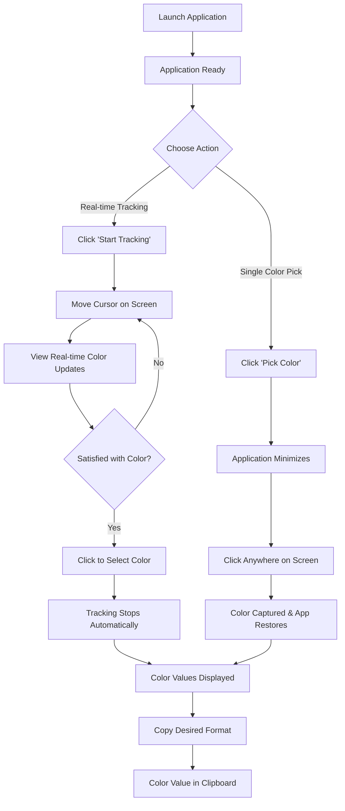
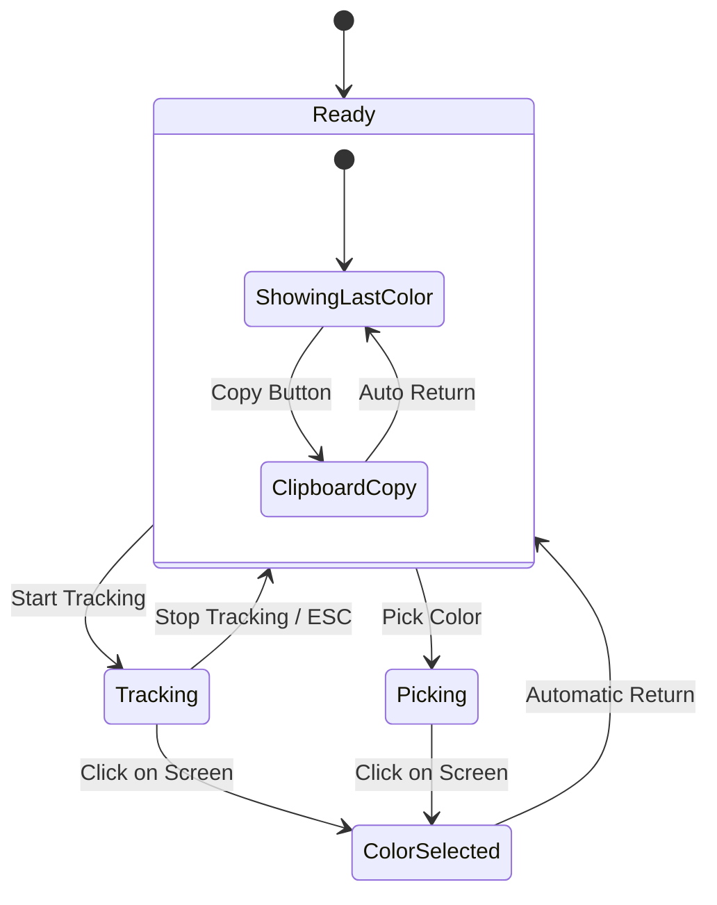

# xsukax Color Picker

A modern, lightweight, and privacy-focused color picker application for Windows that enables precise color sampling from anywhere on your screen with real-time tracking capabilities.

## Project Overview

xsukax Color Picker is a native Windows desktop application built with C++ and the Windows API, designed to provide developers, designers, and digital artists with a powerful yet simple tool for color extraction and analysis. The application offers real-time color tracking, multiple color format support, and an intuitive modern interface that integrates seamlessly with Windows design principles.

The tool captures pixel-perfect color information from any location on your screen and presents it in commonly used color formats (HEX, RGB, HSL), making it invaluable for web development, graphic design, UI/UX work, and digital art creation.

## Security and Privacy Benefits

### **Complete Local Operation**
- **Zero Network Communication**: The application operates entirely offline with no network connections, ensuring your screen content and color data never leave your device
- **No Data Collection**: No user analytics, telemetry, or personal information is collected or transmitted
- **No External Dependencies**: Uses only trusted Windows system APIs, eliminating third-party security risks

### **Minimal System Access**
- **Limited Permissions**: Requires only standard desktop access permissions for screen reading
- **No Administrative Rights**: Runs under standard user privileges without requiring elevation
- **Transparent Operation**: All functionality is clearly visible and user-controlled

### **Data Protection**
- **Ephemeral Data**: Color information exists only during active use and in clipboard when explicitly copied
- **No Persistent Storage**: No configuration files, logs, or cached data stored on your system
- **Secure Clipboard Integration**: Uses Windows' native clipboard API with no additional data retention

## Features and Advantages

### **Core Functionality**
- **Real-time Color Tracking**: Live color sampling as you move your cursor across the screen
- **Precise Color Picking**: Single-click color capture with visual confirmation
- **Multiple Color Formats**: Simultaneous display of HEX, RGB, and HSL values
- **One-Click Clipboard Copy**: Individual copy buttons for each color format
- **Cursor Position Display**: Real-time coordinate tracking for precise placement

### **User Experience**
- **Modern Interface**: Clean, contemporary design following Windows 11 design principles
- **Intuitive Controls**: Simple two-button operation (Track/Pick) with clear visual feedback
- **Responsive Design**: Smooth 30 FPS real-time updates during tracking mode
- **Visual Feedback**: Dynamic status messages and temporary title updates for user actions
- **Keyboard Shortcuts**: ESC key to quickly exit tracking mode

### **Technical Advantages**
- **Lightweight**: Minimal resource usage with native Windows API implementation
- **High Performance**: Optimized for smooth real-time color sampling
- **System Integration**: Follows Windows theming and accessibility standards
- **Cross-Version Compatibility**: Compatible with Windows 7 through Windows 11

## Installation Instructions

### **Prerequisites**
- Windows 7 or later (Windows 10/11 recommended)
- No additional runtime dependencies required

### **Installation Steps**

#### **Option 1: Download Pre-compiled Binary**
1. Navigate to the [Releases](https://github.com/xsukax/xsukax-Color-Picker/releases) page
2. Download the latest `xsukax_Color_Picker.exe` file
3. Place the executable in your preferred directory
4. Run `xsukax_Color_Picker.exe` directly - no installation required

#### **Option 2: Build from Source**
```bash
# Clone the repository
git clone https://github.com/xsukax/xsukax-Color-Picker.git
cd xsukax-Color-Picker

# Compile using Visual Studio or MinGW
# For Visual Studio:
cl xsukax_Color_Picker.cpp resource.rc /link comctl32.lib gdi32.lib user32.lib

# For MinGW:
windres resource.rc -o resource.o
then
g++ -O2 -static -static-libgcc -static-libstdc++ -mwindows xsukax_Color_Picker.cpp resource.o -o xsukax_Color_Picker.exe -lgdi32 -luser32 -lcomctl32
```

### **System Requirements**
- **Operating System**: Windows 7 SP1 or later
- **Memory**: 10 MB RAM
- **Storage**: 2 MB available space
- **Display**: Any resolution supported by Windows

## Usage Guide

### **Basic Operation Workflow**



### **Detailed Usage Instructions**

#### **Starting Color Tracking**
1. Click the **"Start Tracking"** button
2. The button text changes to **"Stop Tracking"**
3. Move your cursor anywhere on the screen
4. Observe real-time color updates in the application
5. Click anywhere to select the current color, or press **ESC** to cancel

#### **Quick Color Picking**
1. Click the **"Pick Color"** button
2. The application briefly minimizes
3. Click anywhere on your screen to capture that pixel's color
4. The application restores with the captured color information

#### **Working with Color Values**
- **HEX Format**: Standard web format (e.g., `#6366F1`)
- **RGB Format**: Red, Green, Blue values (e.g., `99, 102, 241`)
- **HSL Format**: Hue, Saturation, Lightness (e.g., `244 deg, 85%, 67%`)
- Click any **"Copy"** button to place that format in your clipboard

### **Application States**



### **Keyboard Shortcuts**
- **ESC**: Exit tracking mode
- **Mouse Click**: Select color (during tracking) or pick color (during pick mode)

### **Status Messages**
- **"Ready to sample colors from your screen"**: Application ready for use
- **"Move cursor to sample colors - Click to pick - ESC to stop"**: Active tracking mode
- **"Color successfully picked and saved!"**: Color capture confirmation
- **"Copied!"**: Clipboard operation successful

## Licensing Information

This project is licensed under the **GNU General Public License v3.0** (GPL-3.0).

### **What this means:**
- ✅ **Free to use**: Use the software for any purpose
- ✅ **Free to modify**: Modify the source code to suit your needs
- ✅ **Free to distribute**: Share the software with others
- ✅ **Free to contribute**: Submit improvements and bug fixes

### **License Requirements:**
- 📄 **Source code availability**: Modifications must be made available under the same license
- 🏷️ **License notice**: Include the original copyright and license notice
- 📝 **Change documentation**: Document any changes made to the original code

For the complete license text, see the [LICENSE](LICENSE) file in this repository.

### **Third-Party Components**
This application uses only standard Windows API components and requires no third-party libraries, ensuring complete license compatibility and reducing dependency concerns.

---

## Contributing

We welcome contributions! Please feel free to submit issues, feature requests, or pull requests. Make sure to follow the GPL-3.0 license requirements when contributing code.

## Support

For bug reports and feature requests, please use the [GitHub Issues](https://github.com/xsukax/xsukax-Color-Picker/issues) page.

---

**© 2025 xsukax | Licensed under GPL-3.0 | Version 2.0.0**
